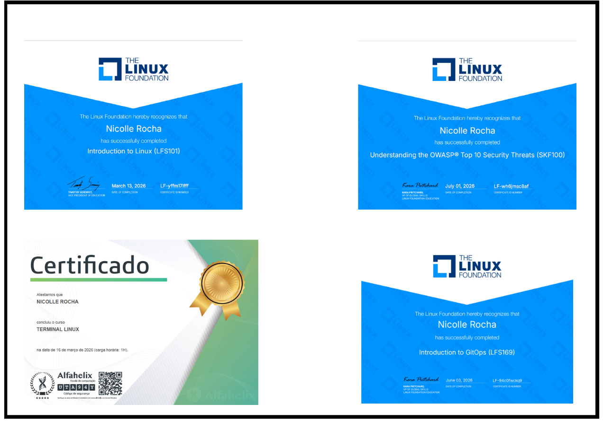
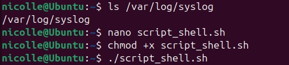
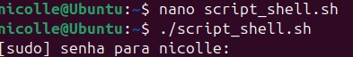
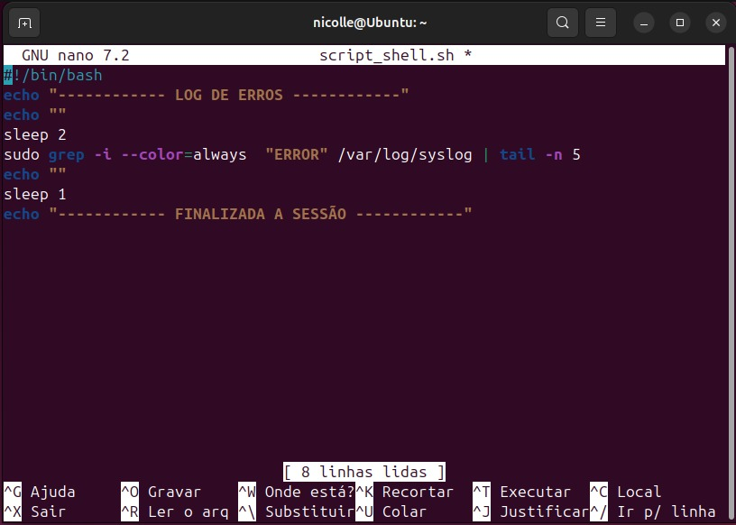

# DOCUMENTAÇÃO 1º SEMESTRE - Nicolle Rocha
Coletânea de aprendizados do meu primeiro semestre como estagiária na empresa 2RP Net.

## Tópicos abordados
- Trilha de conhecimento
- Linux na prática
- Virtualização na prática
- Fluxo Git 
- Automação
- Praticar a organização de pastas
- Aprofundamento em IA
***
 
 

# 1. Cursos da trilha de conhecimento
Vários cursos foram realizados, e todos tinham coisas diferentes a ensinar: Git, virtualização, Linux, etc. A trilha foi feita com foco em desenvolver habilidades técnicas na área de Infraestrutura, no meu caso foi mais específico na área de DevOps, sob supervisão dos meus superiores. Além de ver as aulas, as minhas anotações ajudaram muito a entender o fluxo de informações e ideias.

Ademais, tive a liberdade de poder tirar minhas dúvidas sempre que preciso com o meu time e sempre fui bem recebida. Realizei outros cursos à parte sobre Kubernetes, cibersegurança e IA, a fim de me aprofundar nesses assuntos e entender melhor com o que trabalho e mantive atualizações diárias sobre o meu progresso nos cursos.

 

***

 
 

# 2. Linux na prática

O primeiro curso a ser pedido para ser feito foi uma introdutória ao Linux: um kernel poderoso e muito requisitado para realizar diversas atividades (programadar servidores, sistemas android, computadores) por diversos motivos, incluindo, mas não se limitando a segurança, otimização, personalização completa, sem custo, entre outros.

Para aprofundar meu conhecimento, além do curso fui atrás de quizzes e questionários online e testei minhas habilidades técnicas com listas de exercícios que encontrei na internet. Identifiquei meus pontos fracos e aprimorei-os. A seguir um dos meus primeiros projetos utilizando bash no linux, para uma apresentação:

***

 
 

# 3. Virtualização na prática

A fim de poder treinar comandos básicos do linux, foi necessário eu ter acesso a uma máquina virtual, que pude ter mais conhecimento sobre (uso de memória volátil, disk, armazenamento) realizando o curso da trilha sobre virtualização. O Oracle Box foi o que me ajudou a entender como a virtualização funciona e na prática percebi que usa-se essa tecnologia mais do que eu esperava.

Ao participar de reuniões sobre automatização, notei a presença de virtual machines para testes antes de liberar o produto para acesso geral. Não saberia como que elas funcionassem se não tivesse construído uma base anteriormente.
***

 
 

# 4. Fluxo Git

Git possui uma história longa, ele é mais do que um simples controle de versionamento, e isso é algo que aprendi com um curso da trilha de conhecimento. A parte prática eu já estava familiarizada desde o meu técnico, mas foi no estágio que aprendi a padronizar commits e branches, a alternar de modelo de desenvolvimento e como usar atalhos a meu favor com um simples comando.

O projeto que mais tive que utilizar o git foi na criação de agentes e sub agentes de IA, em que tive que ter certeza de que as minhas mensagens nos commits eram claras para que meu grupo entendesse no que eu estava trabalhando e de que eu estava na minha devida branch.

Git é, mais do que tudo, sobre comunicação. E isso é algo que estou aperfeiçoando, conforme trabalho com pessoas diferentes em projetos que me desafiam - tanto intelectualmente quanto socialmente. 
***

 
 

# 5. Praticar a organização de pastas

A minha primeira demanda como DevOps, organizar as pastas, entender as dores do cliente e meu primeiro contato com tecnologias da área de Infra. A disciplina com as reuniões que realizei com meu grupo para entrarmos em acordo de como a organização deve ser e ouvir os pontos que deveriam ser melhorados na devolução do cliente foi necessária para que eu concluísse este projeto.

Não bastava aceitar que estava errado, eu precisava entender qual era o problema para que eu fosse atrás de uma solução. Realizei pesquisas e compartilhei meus resultados para ter uma visão mais específica de o que cada pasta tratava, e encontrar padrões para agrupá-las. 

O resultado é um trabalho em equipe bem sucedido e aprendizado que jamais irei esquecer.
***

 
 

# 6. Automação Bloqueio/Desbloqueio

A participação ativa foi primordial para que eu entendesse a teoria (desafio) e a prática (solução) deste projeto, que englobou tecnologias que eu ainda não tinha tido acesso. 

As dores do cliente estavam claras, precisava haver padronização quando uma conta fosse bloqueada/desbloqueada. O acompanhamento diário do prcesso de criação deste automação me permitiu aprender a gerenciar softwares de delivery contínuo e controle de acesso. 

Um curso extra sobre uma dessas ferramentas - GLPI - foi iniciado pois ainda há muito para aprender sobre ela e nada melhor que a prática para fixar o conhecimento.
***

 
 

# 7. Aprofundamento em IA

Orquestrador próprio para treinar no início e projeto de crédito 

A primeira parte do meu estudo sobre IA foi aprender a parte teórica que envolveu aprender os termos específicos (LLM, ADK/SDK, sessions, tools) e como as memórias funcionam em sessions diferentes. Entender a lógica por trás de um orquestrador foi fundamental para eu poder partir para a parte prática:

 

**Meu primeiro agente orquestrador.** 

Gerenciar chaves API e tokens foi um verdadeiro desafio, além da programação das tools de cada sub agente utilizado. O resultado é um especialista em biologia, matemática e filmes, com detalhe especial para o agente de filmes: ele possui uma API específica do TMDB que resgata os dados direto do site.

Após esta parte, pude partir para o projeto **dataset Home Credit Default Risk**, agora com uma bagagem mais técnica sobre como agentes IA funcionam. Ainda tinha muito a aprender, mas a base já estava construída.

Neste segundo projeto, com pretexto de cuidar de créditos de clientes de um banco, envolvi pesquisas sobre como as tabelas do Google Cloud estavam organizadas, como o meu sub agente (pagamento) poderia se relacionar com elas, qual a participação da biblioteca Pandas e sua relação com o Python e como formatar a saída do agente orquestrador.

Em um fluxo, basicamente o usuário irá entrar com um ID de um cliente seguido de uma instrução (diga-se que ele queira saber os dados de pagamento desse cliente). O orquestrador irá interpretar o pedido e encaminhar essa instrução ao sub agent específico, que por sua parte irá utilizar quais tools forem necessárias para responder ao pedido. O resultado sai em formato JSON formatado.

Então...

    Usuário → Orquestrador → sub agent → tools → saída em JSON

Clientes com dados nulos/ sem histórico apresentam status= sem dados na saída do prompt, pois as tools não encontram registros válidos para realizar suas análises.
