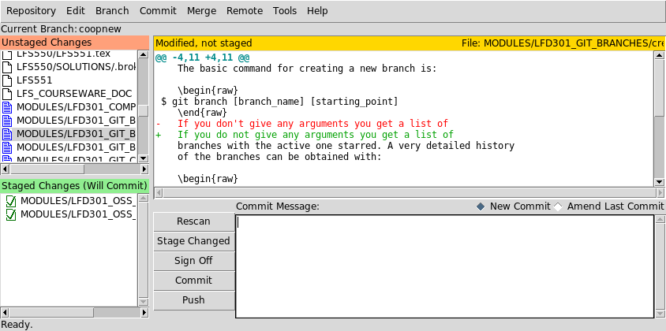
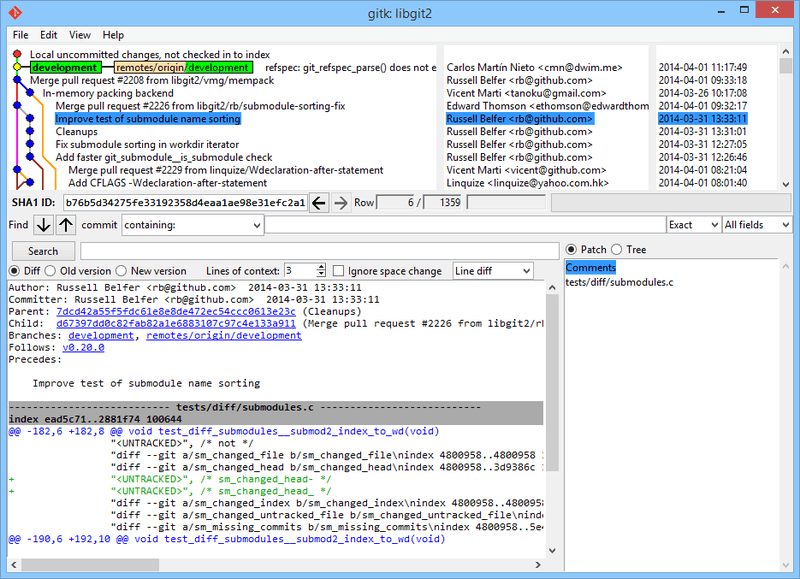

# CONTROLE DE VERSÃO

## Tópicos
# 1. [Introdução](1-Introdução.md)
* 1.1 Instrutor
* 1.2 História
* 1.3 Interfaces Gráficas

- 2. [Gerenciar Arquivos](2-Gerenciar_arquivos.md)
- 3. [Repositórios e Ações](3-Repo_ações.md)
    - 3.1 Commits
    - 3.2 Branches
    - 3.3 Diffs
    - 3.4 Merges
    - 3.5 Patches
    - 3.6 Gerrit
***

 
 

# 1. INTRODUÇÃO
À medida que um projeto cresce com novas funcionalidades e correções, o código diverge drasticamente da sua versão original. Logo, imprevistos ou condições raras surgiram, exigindo que o desenvolvedor localize o ponto exato da falha na história do projeto.

Então, foi sugerida uma maneira mais eficiente de armazenar o histórico de mudanças (as diferenças), economizando espaço em disco e permitindo rastrear a evolução do código de forma direta e inteligente.

## 1.1 Instrutor do curso

Jerry Cooperstein, um especialista veterano em Linux e astrofísica, atua desde 1994 no desenvolvimento e treinamento de sistemas (Kernel e User Space).

Sobre sua carreira acadêmica e científica: ele trabalhou por 20 anos com astrofísica nuclear, criando softwares de simulação em supercomputadores e lecionando em universidades.

Por fim, Ingressou na organização Linux em 2009 e, atualmente, ocupa o cargo de Gerente Sênior de Conteúdo.
***

 

## 1.2 História 
 

O **SCCS (Source Code Control System)**, lançado no início da década de 1970, foi provavelmente o primeiro sistema amplamente disponível para plataformas baseadas em UNIX.

Um código SID, composto por 4 números, é criado sempre que um delta (uma mudança no arquivo) é feita. 

    SID = 1.2.1.4
    Dígito 1 - release
    Dígito 2 - level
    Dígito 3 - branch
    Dígito 4 - sequence
***

 

**CLA (Contributor License Agreement)**

O colaborador assina um contrato (que varia por projeto) concedendo direitos de uso, patentes ou copyright. É ideal para projetos open source, em que uma fundação precisa primeiro avaliar o código e depois aceitá-lo.

    (git commit -s (Signed-off-by))
    No caso do Linux Kernel DCO

- **DCO (Developer Certificate of Origin)**

Criado pela Linux Foundation em 2004 como uma alternativa mais leve. O desenvolvedor apenas "assina" cada commit.
***

 
 

## 1.3 Interfaces Gráficas

### **Desktop**
 

**GIT-GUI:** Escolhe-se o que vai para o commit (staging) e escreve suas mensagens.

 

**GITK:** Ferramenta visual padrão para visualizar como os ramos (branches) se cruzaram no passado.

 

 

### **Servidor (Web)**

**CGIT:** Por ser escrita em C, carrega repositórios gigantes instantaneamente.

**GITWEB:** Cumpre o papel de mostrar o código no navegador, é escrita em Perl e costuma ser mais lenta e visualmente mais datada que o cgit.

 
 

**[Seguir para a próxima página →](2-Gerenciar_arquivos.md)**

 

## 🔗 Referências

[IBM](https://www.ibm.com/docs/en/aix/7.2.0?topic=concepts-source-code-control-system)
[Google Open Source](https://opensource.google/documentation/reference/cla)
[Interfaces gráficas](https://git-scm.com/book/pt-br/v2/Appendix-A:-Git-em-Outros-Ambientes-Graphical-Interfaces)