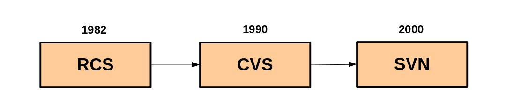

# CONTROLE DE VERSÃO

## Tópicos
- 1. [Introdução](1-Introdução.md)
    - 1.1 Instrutor
    - 1.2 História
    - 1.3 Interfaces Gráficas
# 2. [Gerenciar Arquivos](2-Gerenciar_arquivos.md)
- 3. [Repositórios e Ações](3-Repo_ações.md)
    - 3.1 Commits
    - 3.2 Branches
    - 3.3 Diffs
    - 3.4 Merges
    - 3.5 Patches
    - 3.6 Gerrit
***

 
 

# 2. GERENCIAR ARQUIVOS

Sistemas de controle de versões variadas existiram antes do Git(lab), poder realizar merge sem apagar o seu trabalho ou de outra pessoa é a base desses sistemas, como também trabalhar paralelamente à branch original sem modificá-la.

O Git organiza os arquivos do seu projeto em três categorias principais, sendo elas **Tracked**, **Ignored** e **Untracked**, respectivamente:

* **Arquivos Monitorados:** São arquivos que o Git já conhece, podem estar em seu estado atual no repositório ou indexados (staged), aguardando o próximo commit;

* **Arquivos Ignorados:** São arquivos configurados através do arquivo **.gitignore.** Isso é comum para evitar expor informações sensíveis, como chaves API, e também arquivos temporários ou de compilação, mas é possível criar exceções a essas regras usando o prefixo **!**;

* **Arquivos Não Monitorados:** São arquivos novos no diretório que ainda não foram adicionados ao repositório nem ignorados. Eles tornam-se monitorados assim que são incluídos em um commit.

 
 

**[Seguir para a página anterior ←](1-Introdução.md)**

 

**[Seguir para a próxima página →](3-Repo_ações.md)**

## 🔗 Referências
[Versionamento](https://pt.stackoverflow.com/questions/8315/quais-as-diferen%C3%A7as-entre-git-svn-e-cvs)