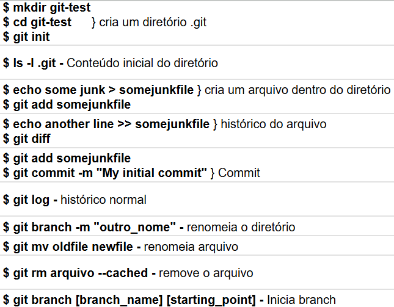
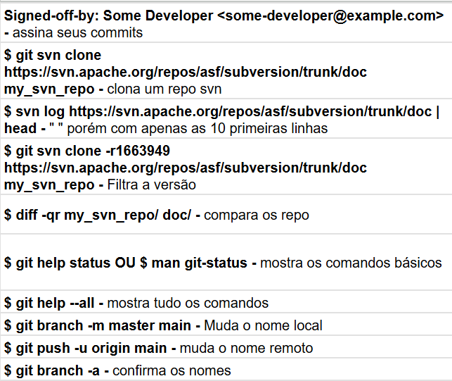
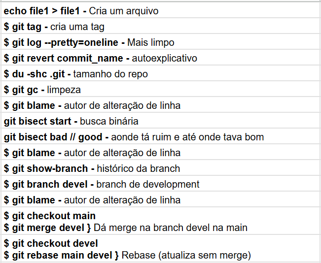
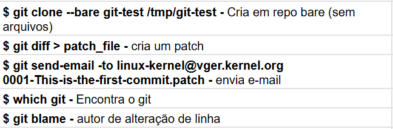

# CONTROLE DE VERSÃO

## Tópicos
- 1. [Introdução](1-Introdução.md)
    - 1.1 Instrutor
    - 1.2 História
    - 1.3 Interfaces Gráficas
- 2. [Gerenciar Arquivos](2-Gerenciar_arquivos.md)
# 3. [Repositórios e Ações](3-Repo_ações.md)
- 3.1 Commits
- 3.2 Branches
- 3.3 Diffs
- 3.4 Merges
- 3.5 Patches
- 3.6 Gerrit
***

 
 

# 3. REPOSITÓRIOS E AÇÕES

## 3.1 Commits

O Git cria objetos de commit a partir do que está no index. Se um arquivo ou diretório não mudou, ele apenas reutiliza o identificador hexadecimal anterior, economizando espaço e tornando o processo mais rápido.

Cada commit recebe um hash único de 160 bits (40 caracteres). Como lidar com esses códigos é difícil, o Git permite o uso de Tags que apontam para um commit específico. É possível referenciar commits usando apenas os primeiros caracteres do hash, desde que sejam únicos no repositório.

### Histórico e Navegação

O comando git log exibe o histórico em ordem reversa. Ele possui variações poderosas: 

    --pretty=oneline

para uma visualização compacta e 

    -p 
para exibir os patches (mudanças exatas) feitos em cada arquivo. Para identificar quem alterou cada linha de um arquivo e em qual commit isso ocorreu, utiliza-se o ***git blame***.
***
 

***Revertendo Alterações***

Existem duas formas principais de desfazer erros: **git revert** (mudança inversa de um commit anterior, não apaga o histórico) e **git reset** (Move a branch para um estado anterior. Pode ser **--soft** (mantém arquivos e index), **--mixed** (limpa o index) ou **--hard** (apaga todas as mudanças locais nos arquivos)).

 

***Manutenção e Otimização***

O comando ***git gc*** realiza a "coleta de lixo", compactando objetos e otimizando o armazenamento. Já o ***git fsck*** busca erros e objetos órfãos, que podem ser removidos definitivamente com o comando ***git prune***.

O ***git bisect*** é uma ferramenta de busca binária para encontrar qual commit introduziu um bug. O Git divide o histórico ao meio repetidamente até isolar a falha, podendo o processo ser automatizado com o ***git bisect run***, executando um script de teste em cada etapa.

 
 

## 3.2 Branches

Uma branch permite trabalhar de forma independente a partir de um ponto original. Isso é essencial para manter uma versão estável enquanto se criam novas funcionalidades, ou para isolar o conserto de um bug crítico sem a interferência de outras mudanças simultâneas.

### Criando e Excluindo Ramos

O comando *git branch [nome]* cria um novo ramo a partir de um ponto de partida. Para organizar o projeto, é possível listar as branches existentes com *git branch* ou excluir ramos desnecessários com *git branch -d*, desde que não esteja neles no momento.

O comando *git checkout* é o que permite transitar entre elas, e ao mudar de ramo, o Git altera instantaneamente os arquivos no diretório para refletir o estado daquela branch específica.

Também pode-se criar e mudar-se para uma nova branch em um único passo usando git *checkout -b [nome]*. Além de ramos inteiros, o checkout também serve para restaurar versões específicas de arquivos individuais. Se precisar recuperar um arquivo como ele estava em uma versão antiga, basta usar *git checkout [tag] [caminho_do_arquivo]*.
***

 
 

## 3.3 Diffs

O comando ***diff*** é a ferramenta que comparara arquivos e diretórios. A forma mais comum de uso é o "formato unificado" *(-u)* (Linhas removidas = - // Linhas adicionadas = +).

Para comparar árvores de diretórios inteiras, usa-se *diff -Nur*, que percorre subpastas recursivamente e trata arquivos novos ou excluídos como parte da diferença.

No Git, o diff é adaptado para as diferentes áreas de controle (Diretório de Trabalho, Index e Repositório):

* **git diff:** Mostra o que foi alterado nos arquivos, mas ainda não adicionado ao index;

* **git diff --staged (ou --cached):** Mostra o que está pronto para o próximo commit em comparação com o último;

* **git diff [commit]:** Compara seu estado atual com qualquer ponto anterior da história ou outra branch.
***

 
 

### Comparações entre Pontos da História
É possível comparar dois estados quaisquer do projeto usando *git diff commit1 commit2*. É possível filtrar essa visualização a fim de focar somente em pastas ou arquivos específicos, evitando assim, o excesso de informação em projetos grandes. Além disso, opções como *--stat* oferecem um resumo estatístico em vez de mostrar o código linha por linha.

O Git oferece flexibilidade para ignorar mudanças irrelevantes, como espaços em branco *(--ignore-all-space)*, o que é útil para focar na lógica do código alterado. Essas ferramentas de diferenciação são a base para entender a evolução do projeto e revisar mudanças antes de consolidá-las no repositório.
***

 
 

## 3.4 Merges

A mesclagem é o processo inverso à ramificação. Por envolver mudanças vindas de desenvolvedores diferentes, obstáculos podem surgir e um conflito pode ocorrer quando o Git não consegue decidir qual alteração prevalecer.

Por isso, ele interrompe o processo e marca o arquivo com etiquetas especiais *(<<<<<<<, =======, >>>>>>>)*. Para resolver isso, o desenvolvedor deve editar o arquivo manualmente, escolher a versão final, adiconá-lo para marcar como resolvido e finalizar com um commit.

 
 

Existem duas formas principais de atualizar um trabalho com as mudanças da linha principal:

* **Merge:** Une as duas versões, sendo um processo seguro que preserva o histórico original de como as coisas aconteceram;

* **Rebase:** "Reescreve" a versão, retirando temporariamente commits, atualiza a base do ramo para a versão mais recente da linha principal e reaplica os commits um a um por cima dela. Isso resulta em um histórico linear e mais limpo.

    * Embora o rebase deixe o histórico mais organizado, ele é considerado "perigoso" se compartilhado porque ele pode confundir outros desenvolvedores que estejam usando sua branch. Além disso, commits que funcionavam na base antiga podem apresentar erros sutis na base nova, exigindo testes rigorosos após a operação.

 

Independentemente da escolha entre merge ou rebase, a recomendação é manter o repositório "limpo" antes de iniciar (fazendo commit de tudo o que está pendente). O uso de commits pequenos e frequentes, aliado a ferramentas como o *git status*, ajuda a minimizar a confusão e facilita a resolução de problemas quando os ramos finalmente se encontram.
***
 

### Repositórios Bare

Para servir como um ponto de sincronização central, utiliza-se um repositório **bare**. Ele é criado com a opção *--bare* e não possui diretórios de trabalho. Sua única função é armazenar os objetos do Git para que as pessoas possam fazer *push* e *pull*.

 

### Protocolos de Comunicação
O Git suporta diversos "idiomas" para transferência de dados:

    git://: O mais rápido, mas geralmente sem autenticação;

    ssh://: Seguro e padrão para desenvolvedores com acesso de escrita;

    https://: Funciona bem através de firewalls e é o mais comum na web;

    file://: Usado para repositórios no mesmo computador ou rede local.

 
 

É possível transformar qualquer máquina em um servidor Git, como utilizar um Daemon com o git daemon, compartilhando o código sendo geralmente apenas leitura. Web é uma opção, também, configurando um servidor como o Apache, permitindo clones via HTTP. O comando *git archive* permite exportar apenas o estado atual do código (sem a pasta .git) em formatos como *.zip* ou *.tar.bz2*, ideal para enviar o código para alguém que não usa Git ou para criar backups de versões específicas.
***

 
 

## 3.5 Patches

**Patches Git** são arquivos de texto que contêm as diferenças entre commits, servindo para compartilhar alterações de código sem usar um repositório remoto. Eles permitem enviar correções por e-mail, sendo cruciais para fluxos de trabalho distribuídos.

O envio de mudanças por e-mail facilita a revisão pública do código antes que ele seja integrado ao repositório oficial. Além disso, permite a colaboração de desenvolvedores que não utilizam Git ou que enfrentam restrições de rede que bloqueiam protocolos específicos de controle de versão. 

O comando *git format-patch* é a ferramenta usada para criar arquivos de patch formatados, transformando commits em arquivos de texto numerados e sequenciais, incluindo a mensagem do autor e metadados. 

 

Para integrar um patch recebido, utiliza-se o comando git *am (apply mailbox)*. Ele é automatizado: aplica as mudanças nos arquivos e já cria o commit correspondente no histórico. Em caso de conflitos, o Git interrompe o processo, permitindo que o desenvolvedor resolva os problemas manualmente antes de prosseguir com *git am --continue* ou desistir com *git am --abort*.

Para um controle mais manual, existem os comandos patch e o *git apply*. O *git apply --check* funciona como um teste para verificar se o patch pode ser aplicado sem erros antes de realmente modificar os arquivos. Esses comandos apenas alteram os arquivos no diretório, deixando a criação do commit para o desenvolvedor.
***

 
 

## 3.6 Gerrit

O Gerrit é uma ferramenta construída sobre o Git que adiciona uma camada de revisão de código sistemática antes que as alterações cheguem ao repositório autoritativo. Ele incentiva que múltiplos colaboradores revisem o código e formaliza o processo de aprovar mudanças, garantindo que nada seja integrado sem passar pelo crivo da comunidade.

Dessa forma, se uma mudança for aceita, ela avança; se precisar de ajustes, o revisor solicita modificações específicas para aquele commit, tornando o processo de aceitação ou rejeição muito mais granular e justo.

 
 

**[Seguir para a página anterior ←](2-Gerenciar_arquivos.md)**

 

## 🔗 Comandos Úteis

--- 
